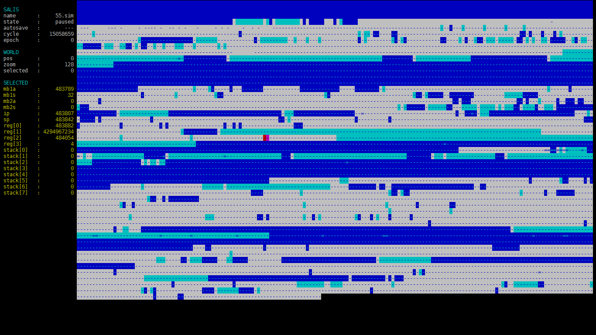

# SALIS: A-Life Simulator

## Overview
*SALIS* is my newest artificial life project. Mainly a re-take on Tom Ray's
TIERRA simulation, but with my very own set of tweaks. Having a grasp on TIERRA
will make understanding this simulation a lot easier.

- [video about TIERRA](https://www.youtube.com/watch?v=Wl5rRGVD0QI)
- [read about TIERRA](http://life.ou.edu/pubs/doc/index.html#What)

For those that already know TIERRA, the main differences between it and SALIS
are:
- the replacement of templates with key-lock instruction pairs
- the addition of a SEEKER POINTER to all organisms

The seeker pointer is an attempt to bring extra spatial and temporal coherence
to the simulation. Allocation, reads and writes will take more time when done
between addresses that are far away, as a consequence of the SP having to
travel those distances at a speed of 1 byte per update. In other words, in
SALIS information can't travel faster than 1 byte per update (SALIS' speed of
light, if you will).

To watch an introductory video about *SALIS*
[go here.](https://www.youtube.com/watch?v=jCFmOCvy6po)

### Details
- *SALIS* is an API, so an UI must be written to communicate with it
- *SALIS* is written in C
- *SALIS* must be compiled as a library (e.g. *libsalis.a*)

### Organisms consist of
- One or two associated memory blocks
- One instruction pointer
- One seeker pointer
- Four registers
- A stack of configurable size (default is 8)

### Queue
- Newborn organisms are placed on top of the queue
- Organisms are killed at the bottom of the queue
- Organisms are killed whenever memory fills above 50%

### Evolution
In *SALIS* mutation occurs via *cosmic rays*: at every cycle a random 32 bit
address is selected and a random instruction is written into it.

### Instruction set
*SALIS*' organisms read a simple language similar to ASM. This language
consists of 64 instructions, each with an associated name and symbol.
Whenever an organism performs an invalid instruction it's considered a *fault*.
To preserve robustness, faulty instructions are simply ignored by the
organisms and their IPs are incremented to the next address.

#### Faults
- IP or SP reaching ends of memory
- Perform a search or attempt a jump without a following key
- Writing to an allocated (but not owned) or invalid address
- Reading (loading) from an invalid address
- SP on address non-adjacent to child memory block while allocating
- Swapping, freeing or splitting when not owning 2 memory blocks
- Dividing by zero

#### Instruction set table
|Name     |Sym.  |Val.  |Description                                                           |
|:--------|:-----|:-----|---------------------------------------------------------------------:|
|NOOP     |      |00    |No operation. Does nothing.                                           |
|NOP0-3   |0-3   |01-04 |No operation. Modifies registers to be used (r0x to r3x).             |
|JMPB-F\* |()    |05-06 |Jump to lock matching following key.                                  |
|ADRB-F\* |[]    |07-08 |Search for lock matching following key and store on r[0].             |
|IFNZ     |?     |09    |If r[0] is not zero, execute following instruction. Skip otherwise.   |
|ALLB-F\* |{}    |10-11 |Allocate block of size stored on r[0]. Store its address on r[0].     |
|BSWP\*   |%     |12    |Swap parent and child memory blocks.                                  |
|BCLR\*   |\|    |13    |Free child memory block.                                              |
|SPLT\*   |$     |14    |Split. Child memory block becomes new organism.                       |
|ADDN     |+     |15    |Add (r[0] = r[1] + r[2]).                                             |
|SUBN     |-     |16    |Subtract (r[0] = r[1] - r[2]).                                        |
|MULN     |\*    |17    |Multiply (r[0] = r[1] \* r[2]).                                       |
|DIVN\*   |/     |18    |Divide (r[0] = r[1] / r[2]). Faults if divisor is zero.               |
|INCN     |^     |19    |Increment (r[0]++).                                                   |
|DECN     |v     |20    |Decrement (r[0]--).                                                   |
|NOTN     |!     |21    |Not (r[0] = !r[0]).                                                   |
|SHFL     |<     |22    |Shift left by 1 (r[0] << 1).                                          |
|SHFR     |>     |23    |Shift right by 1 (r[0] >> 1).                                         |
|ZERO     |z     |24    |Put zero (r[0] = 0).                                                  |
|UNIT     |u     |25    |Put one (r[0] = 1).                                                   |
|PSHN     |#     |26    |Push r[0] to stack.                                                   |
|POPN     |~     |27    |Pop from stack into r[0].                                             |
|LOAD\*   |.     |28    |Load instruction at address pointed by r[0] into r[1].                |
|WRTE\*   |:     |29    |Write instruction on r[1] to address pointed by r[0].                 |
|DUPL     |"     |30    |Duplicate value on r[0] into r[1].                                    |
|SWAP     |x     |31    |Swap values on r[0] and r[1].                                         |
|KEYA-P   |a-p   |32-47 |Keys.                                                                 |
|LOKA-P   |A-P   |48-63 |Locks.                                                                |

Instructions that may fault are marked with an asterisk (\*) on the table above.

Instructions that modify values on registers may be followed by
up to 3 register modifiers (r[0], r[1] and r[2]). By default, all registers
are set to r0x.

|Sample  |r[0] |r[1] |r[2] |Meaning                                   |
|:-------|:----|:----|:----|-----------------------------------------:|
|+123    |r1x  |r2x  |r3x  |r1x = r2x + r3x                           |
|-11     |r1x  |r1x  |r0x  |r1x = r1x - r0x                           |
|\*      |r0x  |r0x  |r0x  |r0x = r0x \* r0x                          |
|!2      |r2x  |---  |---  |r2x = !r2x                                |
|x01     |r0x  |r1x  |---  |swap r0x and r1x                          |
|]a1     |r1x  |---  |---  |r1x = address of closest following LOKA   |
|[b      |r0x  |---  |---  |r0x = address of closest previous LOKB    |

## Building instructions
You'll need nothing but a C compiler (C89). A sample makefile (Makefile)
is provided for GNU Make. Just run `make` inside this directory and the salis
library should compile as well as the tsalis executable. Feel free to edit
the makefile as needed. Code should compile easily on all platforms and on all
C89 compliant compilers. If you run into any difficulties, please let me know!
